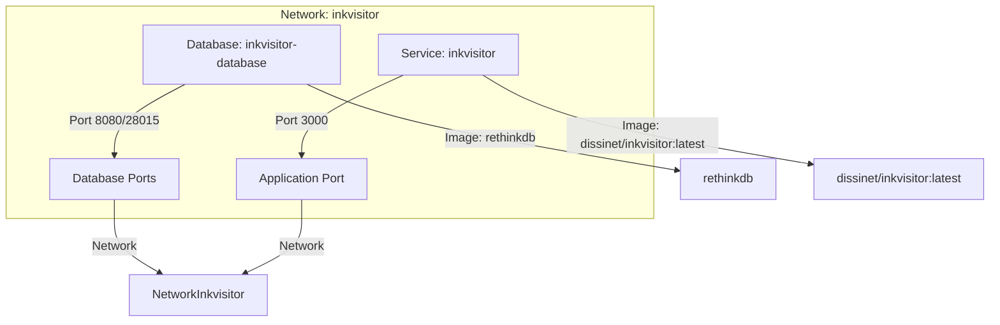

# diagrams
Testing autogenerated mermaid diagrams

```mermaid
graph TD;
    subgraph Network: inkvisitor
        A[Database: inkvisitor-database] -->|Port 8080/28015| DBPorts[Database Ports];
        B[Service: inkvisitor] -->|Port 3000| ServicePort[Application Port];
    end

    A -->|Image: rethinkdb| DatabaseImage[rethinkdb];
    B -->|Image: dissinet/inkvisitor:latest| ServiceImage[dissinet/inkvisitor:latest];

    DBPorts -->|Network| NetworkInkvisitor;
    ServicePort -->|Network| NetworkInkvisitor;
```
